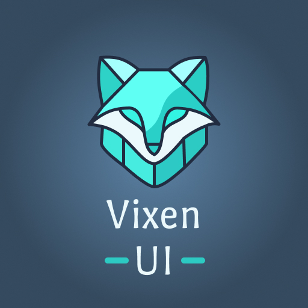

# Vixen Core

Build Ultra fast native and cross platform desktop apps with nodejs and CSS.
Vixen Core is powered by **Qt6** that helps you build CPU and Memory efficient desktop apps as compared to other browser based desktop apps like **Electron**.

> **Note**: Vixen Core is a work in progress project and is not stable yet.

## Features

1. ⛓️ **Cross platform**: Vixen Core Works on Windows, Linux and macOS.
2. ⚡️ **Ultra Efficient**: Currently CPU takes 0% usage on Idle state and the memory usage for a basic program is under 20MB.
3. 💅 **Styles With CSS**: Use CSS To style your UI with full suport to Flexbox layout.
4. 🧰 **Native event listener support**: Thanks to **Qodejs** you can have all the Support for Events from Qt & Nodejs.
5. 🎖️ **Build on top of Typescript**: This project was made on Typescript, but if you like to work with JS, you can use it also.

## Getting Started

- Checkout [Vixen-Core-Starter-Template](https://github.com/Vixen-js/template-vanilla-ts) to setup and run your first vanilla Typescript Vixen Core Application.
- Read through the [Docs Page](./docs/index.md) for more information.
- Check the Examples and Try it out: [https://github.com/Vixen-js/vixen-examples](https://github.com/Vixen-js/vixen-examples)

## Installation

- Install Vixen Core using [NPM](https://www.npmjs.com/package/@vixen-js/core)
```bash
    pnpm i @vixen-js/core
```

if the installation fails to download the Qt binaries, you can set a mirror by setting the following environment variable:

```bash
QT_LINK_MIRROR=<the-mirror-url> pnpm i @vixen-js/core
```

## Requirements

- cmake >= 3.16
- make
- nodejs >= 18.12.1
- pnpm >= 7.0.0